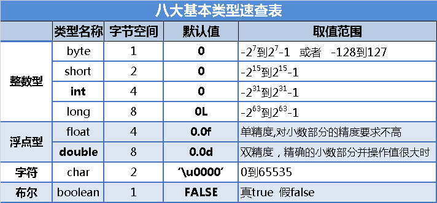

# 数组是引用数据类型

```java
//静态初始化:
int[] a =new int[] {21, 213, 12, 323, 5, 7, 65756};
int[] b = {21, 213, 12, 323, 5, 7, 65756};

//动态初始化:
int[] c=new int[3];
```

# Arrays.toString(int [] arr) 数组相关

> 为什么数组打出来是啥啥啥.
>
> 因为sout调用的是对象的toString()
>
> **数组是new出来的对象**.它调用的是java.lang.Object的方法toString()

# 局部变量要初始化,

> 这个要记住,可以先**定义(声明)**,但是使用前一定要初始化赋值
>
> > 对于变量来说,定义就是声明
> >
> > 但是对于函数来说定义和声明完全不是一回事 
> >
> > ```java
> > void   sum（int a，int b）;//这是函数的声明
> > 
> > void   sum（int a，int b）; //整体是函数的定义
> > {
> > }
> > ```
> >

# 成员变量不需要初始化,默认值为:




